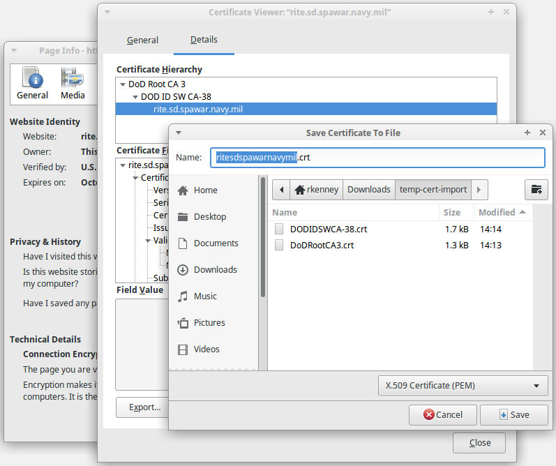

Create the cac-agent Truststore
================


(Windows) Using Windows Truststore
----------------

If your Windows OS (IE/Chrome) already trusts the target SSL certs, you can configure cac-agent to use the system
truststore by creating/editing this file:

	%USERPROFILE%\.moesol\cac-agent\agent.properties

... and ensuring this setting:

	use.windows.trust: true

If you do this, you can skip the next section.


Manually Creating the Truststore
----------------

You need to configure cac-agent to trust the target server's SSL certs.

> NOTE: You cannot use the ```sslVerify=false``` option, as this will cause jgit to setup a custom SSL context
> which will bypass the SSL context that cac-agent uses.
> 

By default, cac-agent will query the system truststore, but you can override this with the following truststore:

* Windows: ```%USERPROFILE%\.moesol\cac-agent\truststore.jks```
* Linux: ```~/.moesol/cac-agent/truststore.jks```

> NOTE: Behind the scenes, cac-agent is setting `javax.net.ssl.trustStore`.
> 

To populate this with your target server certs, navigate to the target server in a browser (such as firefox),
and export the server's cert, and each CA cert, in the ```X.509 Certificate (PEM)``` format:



Then import each of the exported files into the truststore. 

	keytool -import -trustcacerts -noprompt -storepass changeit -keystore <KEYSTORE> \
	  -alias <CERT_FILE> -file <CERT_FILE>

... noting that:

* ```-alias``` is arbitrary, but must be unique, so the cert filenames work just fine.
* ```-storepass changeit``` is the password cac-agent expects.

... and where:

* ```<CERT_FILE>``` is the cert to import
* ```<KEYSTORE>``` is the cac-agent truststore:
	* Windows: ```%USERPROFILE%\.moesol\cac-agent\truststore.jks```
	* Linux: ```~/.moesol/cac-agent/truststore.jks```

For example (for the above image):

	keytool -import -trustcacerts -noprompt -storepass changeit -keystore ~/.moesol/cac-agent/truststore.jks \
	  -alias DODIDSWCA-38.crt -file DODIDSWCA-38.crt
	keytool -import -trustcacerts -noprompt -storepass changeit -keystore ~/.moesol/cac-agent/truststore.jks \
	  -alias DoDRootCA3.crt -file DoDRootCA3.crt 
	keytool -import -trustcacerts -noprompt -storepass changeit -keystore ~/.moesol/cac-agent/truststore.jks \
	  -alias ritesdspawarnavymil.crt -file ritesdspawarnavymil.crt 

